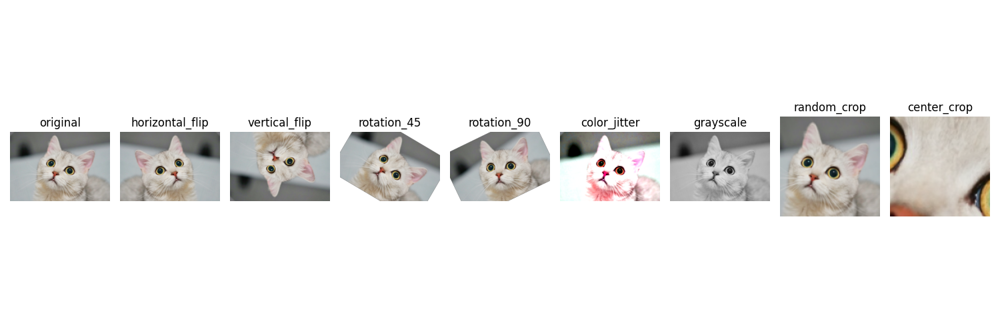

<div align="center">

# <b>COMP7250 Project</b>

[SHUWEN NIU](https://github.com/sw1014)
24484059

</div>

## Introduction
Deep learning has revolutionized the field of computer vision, enabling breakthroughs in tasks such as image classification. However, training a complex deep learning model presents challenges due to the need for a large amount of data to adequately cover the parameter space. The required data often aren't available for various reasons, and insufficient data can lead to overfitting, poor generalization, and suboptimal performance. To address these issues, data augmentation has proven to be an effective way to improve model performance when collecting more real data is difficult. 

This project utilizes the publicly available [CIFAR-10](https://www.cs.toronto.edu/~kriz/cifar.html) dataset and convolutional neural networks to compare the effectiveness of different data augmentation techniques in image classification tasks.



## Getting Started

* Create a conda or python environment and activate: `conda create -n xxx python=3.9; conda activate xxx`.
* Install the corresponding version of PyTorch based on your CUDA environment.
* Install other requirements: `pip install onnx; pip install netron`;


## Project Directory Structure

### COMP7250-Project
- **augmented_images**: Stores the visualization results of applying various data augmentation techniques to test image.

- **checkpoints**: Contains the model weight files and training curves corresponding to models trained with different data augmentation techniques.

- **cat.png**: Test image.

- **model.png**: Network architecture diagram.

- **network_structure.onnx**: Converts the PyTorch model to an ONNX model.

- **readme.md**

- **test.py**: Loads weight files and tests the model.

- **train.py**: Trains the model.

- **vis_data_aug.py**: Visualizes the results of data augmentation.

## Training
```
python train.py
```
## Evaluation

```
python test.py
```
